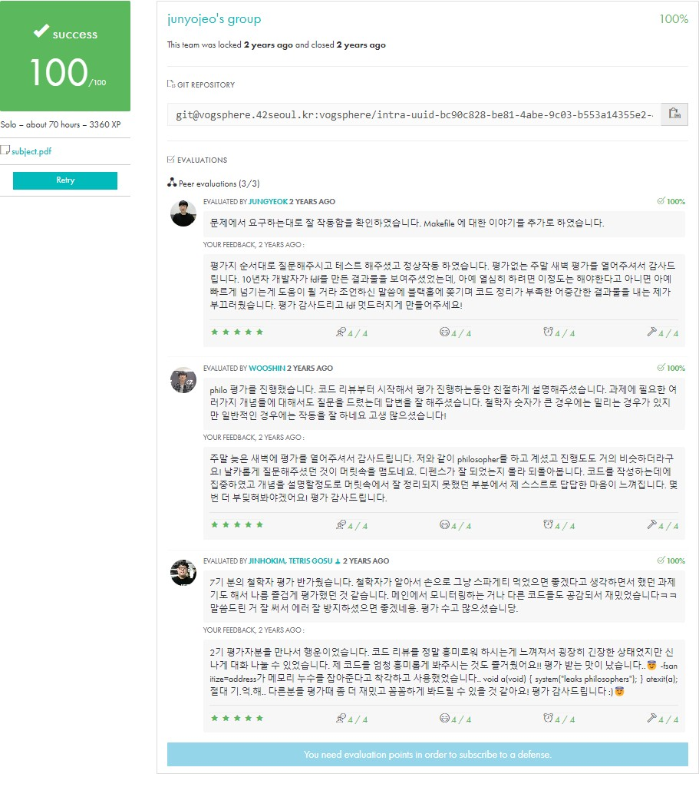

<div align="center">
  <h1>🍝 Philosophers</h1>
  <p>42Seoul의 멀티스레딩 프로젝트: 식사하는 철학자들의 문제</p>

  

  [](https://github.com/your-username/philosophers)
  [](https://github.com/42School/norminette)
</div>

## 📋 목차
1. [프로젝트 소개](#-프로젝트-소개)
2. [필수 요구사항](#-필수-요구사항)
3. [설치 및 실행](#-설치-및-실행)
4. [구현 가이드](#-구현-가이드)
5. [동기화 처리](#-동기화-처리)
6. [보너스 파트](#-보너스-파트)
7. [트러블슈팅](#-트러블슈팅)
8. [테스트 케이스](#-테스트-케이스)
9. [디버깅 가이드](#-디버깅-가이드)
10. [참고 자료](#-참고-자료)

## 🎯 프로젝트 소개
Philosophers는 동시성 프로그래밍의 고전적인 문제인 '식사하는 철학자들'을 해결하는 프로젝트입니다. 여러 철학자들이 원형 테이블에 앉아 생각하고, 먹고, 자는 행동을 반복하며, 이 과정에서 발생할 수 있는 교착 상태(deadlock)와 경쟁 상태(race condition)를 해결해야 합니다.

### 주요 학습 목표
- 멀티스레딩 프로그래밍
- 뮤텍스를 이용한 동기화
- 데드락과 레이스 컨디션 방지
- 리소스 관리와 모니터링

## 📃 필수 요구사항

### 1. 프로그램 규칙
```bash
./philo number_of_philosophers time_to_die time_to_eat time_to_sleep [number_of_times_each_philosopher_must_eat]
```
- number_of_philosophers: 철학자의 수 (포크의 수와 동일)
- time_to_die: 마지막 식사 후 죽기까지의 시간 (ms)
- time_to_eat: 식사하는데 걸리는 시간 (ms)
- time_to_sleep: 수면 시간 (ms)
- number_of_times_each_philosopher_must_eat: [선택] 각 철학자가 먹어야 하는 횟수

### 2. 기본 동작
```c
// 철학자의 상태
typedef enum e_state
{
    THINKING,   // 생각하는 중
    EATING,     // 식사 중
    SLEEPING,   // 수면 중
    DEAD        // 사망
} t_state;

// 철학자 구조체
typedef struct s_philo
{
    int             id;             // 철학자 번호
    t_state         state;          // 현재 상태
    int             eat_count;      // 식사 횟수
    uint64_t        last_meal;      // 마지막 식사 시간
    pthread_mutex_t *left_fork;     // 왼쪽 포크
    pthread_mutex_t *right_fork;    // 오른쪽 포크
    struct s_data   *data;          // 공유 데이터
} t_philo;
```

### 3. 동작 순서
1. 각 철학자는 스레드로 생성됨
2. 철학자는 생각 → 식사 → 수면 순서로 행동
3. 식사를 위해서는 양쪽의 포크가 필요
4. 정해진 시간 내에 식사하지 못하면 사망
5. 한 철학자가 사망하면 시뮬레이션 종료

### 4. 출력 규칙
```c
// 상태 변화 출력 함수
void print_state(t_philo *philo, char *message)
{
    uint64_t timestamp = get_time() - philo->data->start_time;
    
    pthread_mutex_lock(&philo->data->print);
    if (!philo->data->is_dead)
        printf("%llu %d %s\n", timestamp, philo->id + 1, message);
    pthread_mutex_lock(&philo->data->print);
}

// 출력 예시
// timestamp_in_ms X has taken a fork
// timestamp_in_ms X is eating
// timestamp_in_ms X is sleeping
// timestamp_in_ms X is thinking
// timestamp_in_ms X died
```

## 🔨 설치 및 실행

### 1. 컴파일
```makefile
NAME		= philo
CC			= cc
CFLAGS		= -Wall -Wextra -Werror
RM			= rm -f
PTHREAD		= -pthread

SRCS		= main.c \
			  init.c \
			  utils.c \
			  monitor.c \
			  routine.c \
			  time.c

OBJS		= $(SRCS:.c=.o)

all:		$(NAME)

$(NAME):	$(OBJS)
			$(CC) $(CFLAGS) $(PTHREAD) -o $(NAME) $(OBJS)

clean:
			$(RM) $(OBJS)

fclean:		clean
			$(RM) $(NAME)

re:			fclean all

.PHONY:		all clean fclean re
```

### 2. 실행 예시
```bash
# 기본 테스트
./philo 4 410 200 200

# 모든 철학자가 7번 먹어야 하는 경우
./philo 5 800 200 200 7

# 죽음이 발생하는 케이스
./philo 4 310 200 200
```

## 🛠 구현 가이드

### 1. 시간 관리
```c
// 현재 시간 얻기 (밀리초)
uint64_t get_time(void)
{
    struct timeval tv;
    
    gettimeofday(&tv, NULL);
    return ((tv.tv_sec * (uint64_t)1000) + (tv.tv_usec / 1000));
}

// 대기 함수
void ft_usleep(uint64_t time)
{
    uint64_t start;
    uint64_t current;
    
    start = get_time();
    while (1)
    {
        current = get_time();
        if (current - start >= time)
            break;
        usleep(100);
    }
}
```

### 2. 모니터링 시스템
```c
// 철학자 상태 모니터링
void *monitor(void *arg)
{
    t_data *data;
    int i;
    
    data = (t_data *)arg;
    while (!data->is_dead)
    {
        i = -1;
        while (++i < data->num_philos)
        {
            if (get_time() - data->philos[i].last_meal > data->time_to_die)
            {
                print_state(&data->philos[i], "died");
                data->is_dead = 1;
                break;
            }
        }
        usleep(1000);
    }
    return (NULL);
}
```

## 🌟 보너스 파트

### 1. 세마포어 버전
```c
// 세마포어 초기화
sem_t *forks;
forks = sem_open("/forks", O_CREAT, 0644, num_philos);

// 포크 획득
void take_forks_sem(t_philo *philo)
{
    sem_wait(philo->data->forks);
    print_state(philo, "has taken a fork");
    sem_wait(philo->data->forks);
    print_state(philo, "has taken a fork");
}

// 포크 반환
void release_forks_sem(t_philo *philo)
{
    sem_post(philo->data->forks);
    sem_post(philo->data->forks);
}
```

## 🔧 디버깅 가이드

### 1. 데드락 디버깅
```c
// 데드락 감지를 위한 로깅
void log_fork_status(t_philo *philo)
{
    printf("Philo %d trying to take forks at %llu ms\n", 
           philo->id, get_time() - philo->data->start_time);
}
```

### 2. 시각화 도구
```bash
# 실행 상태 시각화 (별도 스크립트 필요)
./visualizer.py ./philo 5 800 200 200
```

### 3. 일반적인 디버깅 팁
- gdb 사용하여 스레드 추적
- valgrind로 메모리 누수 확인
- helgrind로 데이터 레이스 확인

### 4. 철학자 테이블 배치도
```
       🍽️ Fork
           ↑
   Phil1 ←🪑→ Phil2
  ↗               ↘
🍽️                 🍽️
 ↑                  ↓
Phil5            Phil3
    ↖          ↙
        Phil4
          ↓
         🍽️
```

## 🔄 동기화 처리

### 1. 포크 관리
```c
// 포크 잡기
int take_forks(t_philo *philo)
{
    pthread_mutex_lock(philo->left_fork);
    print_state(philo, "has taken a fork");
    pthread_mutex_lock(philo->right_fork);
    print_state(philo, "has taken a fork");
    return (0);
}

// 포크 내려놓기
void release_forks(t_philo *philo)
{
    pthread_mutex_unlock(philo->left_fork);
    pthread_mutex_unlock(philo->right_fork);
}
```

### 2. 데드락 방지
```c
// 짝수/홀수 철학자 구분으로 데드락 방지
void *philo_routine(void *arg)
{
    t_philo *philo;
    
    philo = (t_philo *)arg;
    if (philo->id % 2)
        ft_usleep(10);
    while (!philo->data->is_dead)
    {
        take_forks(philo);
        eating(philo);
        release_forks(philo);
        sleeping(philo);
        thinking(philo);
    }
    return (NULL);
}
```

## 🧪 테스트 케이스

### 1. 기본 테스트
```bash
# 데드락이 발생하지 않는 케이스
./philo 5 800 200 200

# 철학자가 충분히 먹는 케이스
./philo 5 800 200 200 7

# 철학자가 죽는 케이스
./philo 4 310 200 100
```

### 2. 엣지 케이스
```bash
# 최소 철학자 수
./philo 1 800 200 200

# 큰 수의 철학자
./philo 200 800 200 200

# 매우 짧은 시간
./philo 4 200 200 200
```

## 🔍 트러블슈팅

### 1. 레이스 컨디션
```c
// 공유 데이터 보호
pthread_mutex_t data_mutex;

void update_shared_data(t_data *data)
{
    pthread_mutex_lock(&data_mutex);
    // 공유 데이터 업데이트
    pthread_mutex_unlock(&data_mutex);
}
```

### 2. 메모리 누수 방지
```c
// 자원 해제 함수
void cleanup(t_data *data)
{
    int i;
    
    i = -1;
    while (++i < data->num_philos)
        pthread_mutex_destroy(&data->forks[i]);
    pthread_mutex_destroy(&data->print);
    free(data->philos);
    free(data->forks);
}
```

## 📚 참고 자료

### 1. 필수 함수
```c
pthread_create()
pthread_detach()
pthread_join()
pthread_mutex_init()
pthread_mutex_destroy()
pthread_mutex_lock()
pthread_mutex_unlock()
```

### 2. 체크리스트
- [x] 데드락 없음
- [x] 레이스 컨디션 없음
- [x] 메모리 누수 없음
- [x] 정확한 시간 측정
- [x] 올바른 포크 관리
- [x] 정확한 죽음 감지
- [ ] 보너스 파트 (세마포어 버전)